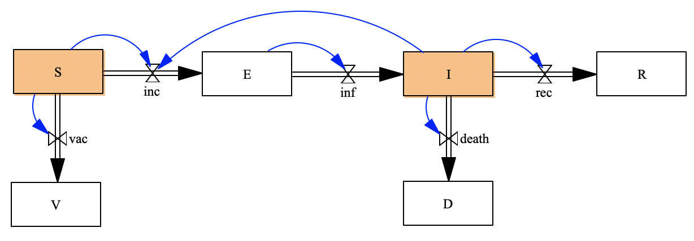
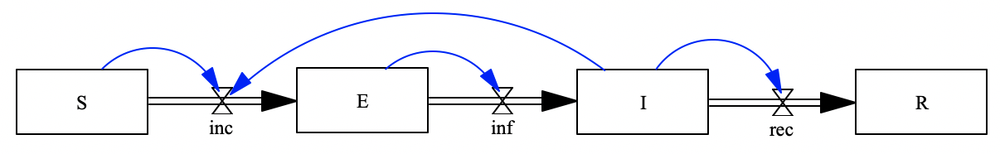
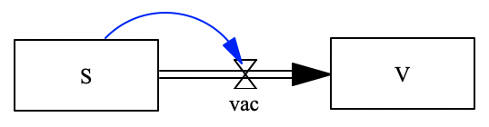
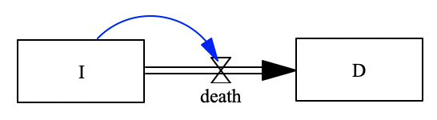

# Problem: SEIRVD Model

```julia
using StockFlow

using Catlab
using Catlab.CategoricalAlgebra
using LabelledArrays
using OrdinaryDiffEq
using Plots

using Catlab.Graphics
using Catlab.Programs
using Catlab.WiringDiagrams
```

To build the SEIRVD stock and flow diagram model:

By composing three sub-components.

## Step 1: Define Stock and Flow Diagrams for the sub-components

### 1.1 Define SEIR model

**Model 1: SEIR model**


The functions of flows are given by:

```julia
finc(u,p,t)=p.cβ*u.S*u.I/p.N
finf(u,p,t)=u.E * p.rlatent
frec(u,p,t)=u.I * p.rrec
```

Now, please define the stock and flow diagram of the SEIR model:

```julia
# StockAndFlowp(stocks,
#               (flow=>function, upstream=>downstream) => stocks linked)
```

You can plot the define stock and flow diagram by call function: ```Graph()```

```julia
Graph()
```

### 1.2 Define the SV model

**Model 2: SV model** (simulates the vaccination process):


The function of flow vac is given

```julia
fvac(u,p,t)=u.S * p.rv
```

Now, please define the stock and flow diagram and plot it

```julia
# StockAndFlowp(stocks,
#               (flow=>function, upstream=>downstream) => stocks linked)
```

### 1.3 Define the ID model

**Model 3: ID model** (simulates the deaths due to infected disese)


```julia
fdeath(u,p,t)=u.I * p.rd
```

Now, please define the stock and flow diagram and plot it

```julia
# StockAndFlowp(stocks,
#               (flow=>function, upstream=>downstream) => stocks linked)
```

## Step 2: Define the UWD-algebra composition rule

```julia
uwd_seirvd = @relation (S, I) begin

end;
display_uwd(uwd_seirvd)
```

Apply the composition rule to the open stock and flow diagrams

```julia
seirvd=oapply(uwd_seirvd,Dict()) |> apex
Graph(seirvd)
```

## Step 3: Solve the composed model

Define the constant parameters values, and stocks initial values. The values are given. Please note those values are arbitrary given for toy model running. You can try to modify those values based on your interested infectious diseases.

```julia
p = LVector(
    cβ=0.2, N=1000, rrec=0.083, rv=0.02, rlatent=0.2, rd=0.0001
)
# Define initial values for stocks
u0 = LVector(
    S=990, E=0, I=10, R=0, V=0, D=0
)
```

Solve the ODEs generated from the composed stock and flow diagram

```julia
prob = ODEProblem(vectorfield(seirvd),u0,(0.0,100.0),p);
sol = solve(prob,Tsit5(),abstol=1e-8);
plot(sol)
```
