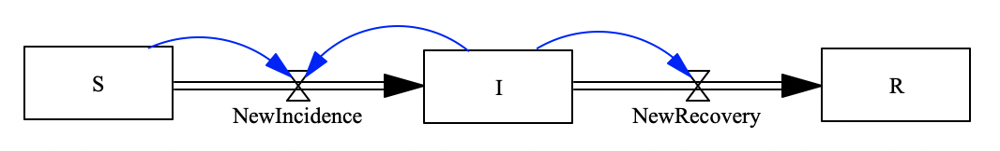

```
using StockFlow

using Catlab
using Catlab.CategoricalAlgebra
using LabelledArrays
using OrdinaryDiffEq
using Plots

using Catlab.Graphics
using Catlab.Programs
using Catlab.WiringDiagrams
```

# Problem: SIRV Model

To compose a SIRV model as follows:


## Step 1. Define sub-components

### 1.1 Define SIR model



The definition of the SIR model are as follows:

```julia
# Define functions ϕ of flows in the SIR model
fNewIncidence(u,p,t)=p.cβ*u.S*u.I/p.N
fNewRecovery(u,p,t)=u.I/p.tr

# StockAndFlowp(stocks,
#               (flow=>function, upstream=>d
sir = StockAndFlowp((:S, :I, :R), 
   ((:NewIncidence=>fNewIncidence, :S=>:I)=>(:S,:I),
    (:NewRecovery=>fNewRecovery, :I=>:R)=>:I)
)
```

Now, we just created a Stock and Flow Diagram of a SIR model with the primitive schema. We can plot the Stock and Flow Diagram:

```julia
Graph(sir)
```

### 1.2 Define SVI model

The SVI stock and flow Diagram is as follows:


```julia
# Define functions ϕ of flows in the SVI model
fNewIncidenceFromV(u,p,t)=p.cβ*u.V*u.I*(1-p.e)/p.N
fNewVaccinated(u,p,t)=u.S*p.rv


# StockAndFlowp(stocks,
#               (flow=>function, upstream=>do
Graph(svi)
```


### Composition method 1 -- via structured cospan

#### Open SIR stock and flow Diagram as a structured cospan, with the left leg [:R], and with the right leg [:S, :I]

```julia

```

#### Open SVI stock and flow Diagram as a structured cospan, with the left leg [:S,:I], and with the right leg [:V]

```julia

```

#### Now, we can compose those two structured cospan with the common foot [:S,:I]. And the composed model is the SIRV model we need

```julia
sirv1=apex()
```

```julia
Graph(sirv1)
```

### Composition method 2 -- via uwd-algebra

#### Define the composition rule of the uwd-algebra

```julia
uwd_sirv = 
display_uwd(uwd_sirv)
```

```julia
sirv2=oapply(uwd_sirv,Dict()) |> apex
```

```julia
Graph(sirv2)
```

### Solve the SIRV model

Define constant parameters and initial values

```julia
p_sirv = LVector(
    cβ=0.2, N=1000, tr=12, rv=0.02, e=0.9
)
# Define initial values for stocks
u0_sirv = LVector(
    S=990, I=10, R=0, V=0
)
```

#### Model results of sirv1 generated by the method of composing the structured cospan

```julia
prob_sirv1 = ODEProblem(vectorfield(sirv1),u0_sirv,(0.0,100.0),p_sirv);
sol_sirv1 = solve(prob_sirv1,Tsit5(),abstol=1e-8);
plot(sol_sirv1)
```

#### Model results of sirv2 generated by the method of composing using uwd-algebra

```julia
prob_sirv2 = ODEProblem(vectorfield(sirv2),u0_sirv,(0,100.0),p_sirv)
sol_sirv2 = solve(prob_sirv2,Tsit5(),sbstol=1e-8);
plot(sol_sirv2)
```
